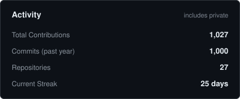
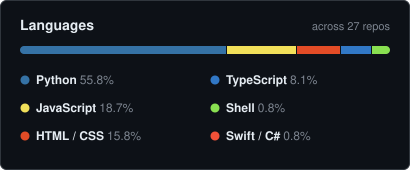

# Timur

I write code mostly when doing something by hand starts getting on my nerves, or when I want my health data, workouts, and everyday tools talking to each other without ten subscriptions in the middle.

I work in fintech operations and key accounts by day, and spend my evenings building self-hosted apps, MCP connectors, and small web tools. Most of it lives in private repos wired into my own setup, with a few public projects below.

---

## Projects

**[vitals](https://github.com/ilodezis/vitals)** — Self-hosted health data lake and dashboard across 15 domains. Pulls Garmin and Hevy data into PostgreSQL, parses lab PDFs and InBody sheets with LLMs, sends morning and evening Telegram briefs, and gives Claude 75 read/write MCP tools over OAuth 2.0.

**[hevy-mcp](https://github.com/ilodezis/hevy-mcp)** — Remote MCP server connecting Claude to the Hevy workout tracker for reading workout history, tracking progression, and editing routines from chat.

**[trumpinator](https://github.com/ilodezis/trumpinator)** — Paste any text, get it back rewritten as a Trump post. Runs on Cloudflare Workers and Workers AI.

**[stack](https://github.com/ilodezis/stack)** — Offline local-first PWA for tracking daily supplements, rituals, and skincare routines.

---

## Stack

---

## Stats

  <picture>
    <source media="(prefers-color-scheme: dark)" srcset="./assets/overview-dark.svg" />
    <source media="(prefers-color-scheme: light)" srcset="./assets/overview-light.svg" />
    
  </picture>
  <picture>
    <source media="(prefers-color-scheme: dark)" srcset="./assets/langs-dark.svg" />
    <source media="(prefers-color-scheme: light)" srcset="./assets/langs-light.svg" />
    
  </picture>

